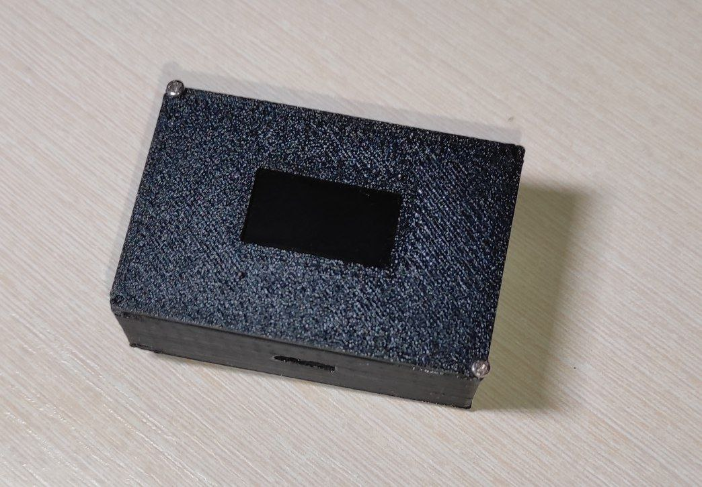

# ESP32-C3 Portable Thermo-Hygrometer

Portable temperature and humidity monitor based on an ESP32-C3 Super Mini.

The device was designed as a standalone battery-powered prototype with a custom 3D-printed enclosure.

---

## Project Goal

The goal of the project was to design and build a compact portable measurement device using an inexpensive microcontroller, environmental sensor, OLED display and a recycled battery.

The project combines:

- embedded firmware development;
- sensor integration;
- OLED display control;
- battery-powered operation;
- 3D modeling and printing;
- practical hardware testing.

---

## System Architecture

```text
              ┌──────────────────┐
              │      DHT11       │
              │ Temperature      │
              │ Humidity         │
              └────────┬─────────┘
                       │
                       ▼
              ┌──────────────────┐
              │     ESP32-C3     │
              │    Super Mini    │
              └────────┬─────────┘
                       │
                       │ I²C
                       ▼
              ┌──────────────────┐
              │   SSD1306 OLED   │
              │      128×64      │
              └──────────────────┘

                 Battery
                    │
                    ▼
          Charging / Power Circuit
                    │
                    ▼
                ESP32-C3
```

---

## Electrical Scheme

Complete electrical connection scheme:

<p>

</p>

---

## Hardware

The prototype uses:

- ESP32-C3 Super Mini
- DHT11 temperature and humidity sensor
- SSD1306 128×64 OLED display
- Nokia battery
- charging / power circuitry
- custom 3D-printed enclosure

The battery capacity is approximately **800 mAh**.

---

## Device

Final prototype:

<p>

</p>

---

## Software

**Programming language:**

- C++

**Platform:**

- Arduino

**Libraries:**

- Adafruit Sensor
- DHT
- DHT Unified
- Adafruit GFX
- Adafruit SSD1306
- Wire

---

## Hardware Interfaces

### DHT11

The DHT11 is used to measure:

- temperature;
- relative humidity.

### SSD1306

The 128×64 OLED displays the measured values.

Current interface configuration:

```text
DHT11 DATA → GPIO 1

OLED:
SDA → GPIO 8
SCL → GPIO 9
I²C address → 0x3C
```

---

## Firmware Responsibilities

The firmware:

1. Initializes the DHT11 sensor.
2. Initializes the I²C interface.
3. Initializes the SSD1306 display.
4. Reads temperature.
5. Reads relative humidity.
6. Displays the measured values.
7. Reports sensor errors through the serial interface and display.

---

## Prototype Results

The prototype successfully performs temperature and humidity measurements and displays the results on the OLED.

During practical testing several engineering limitations were identified.

---

## Known Limitations

### 1. Temperature Measurement Error

The DHT11 sensor is positioned close to the charging/discharging circuitry.

Heat generated by the power electronics affects the sensor and causes the measured temperature to be several degrees higher than the surrounding environment.

**Cause:** thermal influence from nearby electronics.

---

### 2. Slow Temperature Stabilization

The device was designed as a portable solution for quick temperature measurements.

In practice, the DHT11 temperature reading changes slowly and may require approximately **30–40 minutes** to stabilize after a significant environmental change.

This makes the current prototype unsuitable for accurate instant temperature measurement.

---

### 3. Limited Battery Life

The approximately **800 mAh** battery provides around **20 hours** of operation.

For a portable measurement device, this is lower than expected.

---

## Engineering Lessons

This prototype demonstrated several practical hardware design considerations:

- Sensor placement can directly affect measurement accuracy.
- Heat generated by power electronics must be considered during mechanical design.
- Sensor response time can become a system-level limitation.
- Battery capacity alone does not determine operating time.
- Practical testing can reveal limitations that are not obvious during the initial design stage.

---

## Possible Next Revision

Potential improvements include:

- moving the DHT11 farther away from the power circuitry;
- improving thermal isolation;
- replacing the DHT11 with a faster and more accurate sensor;
- measuring the real current consumption of the complete device;
- reducing power consumption;
- introducing low-power operating modes;
- redesigning the enclosure around the thermal behavior of the electronics.

---
## Project Status

**Status:** Experimental hardware prototype.
